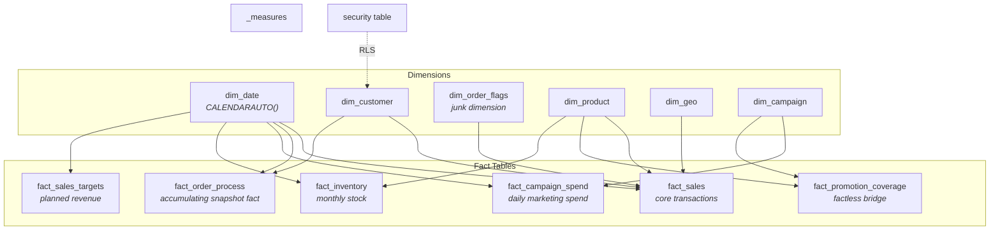
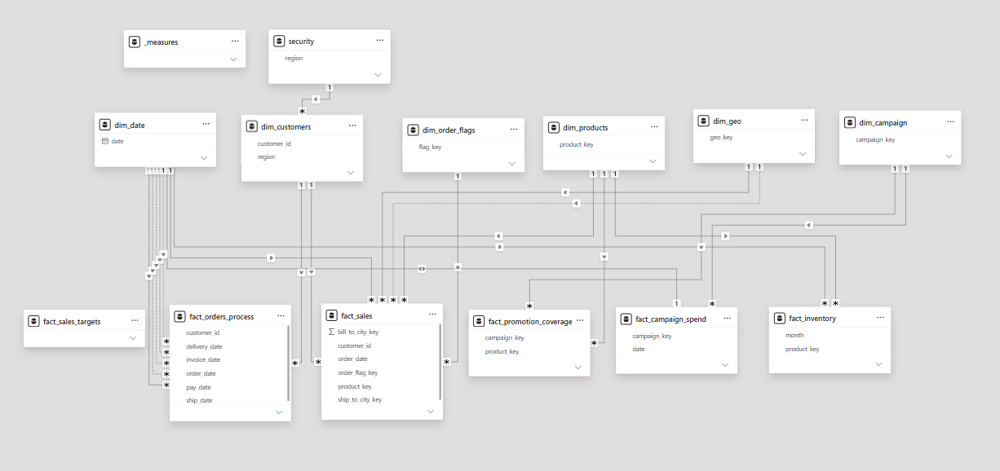

# 🌌 Rebuilding a Broken Power BI Model into a Production-Ready Star Schema
### A Power BI Data Modeling Deep-Dive


> **23 raw, tangled tables. One deliberately broken data model. Zero shortcuts.**
> This repository documents the full rebuild of a chaos dataset into a tested, secured, production-style star schema — following the same discipline a real BI engagement demands.

---

## 📸 Preview

<!-- Replace with your actual screenshots -->
| Before: The Chaos | After: The Star Schema (Galaxy) |
|:---:|:---:|
|  |  |


---

## 🎯 TL;DR

I was handed a Power BI dataset engineered to look exactly like the kind of model that ruins reports in real companies: many-to-many relationships firing in every direction, duplicate imports, cryptic technical IDs, mixed naming conventions, and at least one table that was pure garbage. My job was to turn it into a **clean, testable, secure star schema** — from raw tables to Row-Level Security — using the same standards, checks, and debugging discipline a senior BI developer would apply on a client project.

**The result:** 23 chaotic source tables consolidated into a governed model of 4 core dimensions, 6 purpose-built fact tables, a self-maintaining date dimension, a centralized measures library, and region-based security — with every structural change verified against a protected "sentinel" total before it was ever trusted.

📖 **Want the full story — the debugging incidents, the trade-off decisions, the DAX?**
👉 See **[`Elaborated_walkthrough.md`](./Elaborated_walkthrough.md)** for the complete, step-by-step narrative.

---

## 🧩 The Challenge

The starting dataset simulated the exact failure mode most companies eventually hit: dashboards built directly on top of raw source tables, with no modeling layer in between. The symptoms were everywhere —

- 🕸️ Many-to-many relationships and bidirectional filters, with **facts wired directly to other facts**
- 👯 Duplicate tables from bad imports (`shipments` vs `sheet1` — identical, unexplained)
- 🗑️ At least one table with zero usable content (`dimension_order`)
- 🔤 Mixed naming conventions (PascalCase, camelCase, raw source labels) across tables
- 🔑 A tangle of hash keys, source IDs, and cryptic numeric codes with no documented meaning
- 👤 The same real-world entity referred to by two different names (`customer` vs `user`) depending on which table you opened

None of this is exaggerated for effect — it's a faithful composite of patterns that show up constantly in production BI environments once reporting gets bolted onto operational data without a modeling layer.

---

## 🏗️ What This Project Demonstrates


| Skill Area | Applied |
|---|---|
| **Dimensional Modeling** | Star schema design, grain analysis, snowflake-vs-star trade-offs, junk dimensions, factless facts, accumulating snapshot facts, role-playing dimensions |
| **Power Query (M)** | Merges, appends, unpivoting, delimiter splitting/exploding, deduplication, cardinality testing, folder-based query organization |
| **Data Quality Debugging** | Caught and resolved a live fan-out bug caused by duplicate dimension rows — verified using a protected sentinel measure |
| **DAX** | `CALENDARAUTO()`, `DISTINCTCOUNT` vs `COUNTROWS` grain-awareness, `DATEDIFF`, `LOOKUPVALUE`, `USERPRINCIPALNAME()`, `USERELATIONSHIP` |
| **Security** | Region-based Row-Level Security, tested via user impersonation (`View As`) |
| **Governance & Standards** | Naming conventions, surrogate key discipline, a single centralized measures table, documented technical debt |

--- 

## 📈 Project Outcomes

| Metric | Before | After |
|---------|---------|--------|
| Tables in model | 23 | 13 |
| Fact tables | Mixed operational tables | 6 purpose-built facts |
| Dimension tables | None | 4 conformed dimensions |
| Relationships | Many-to-many | One-to-many |
| Security | None | Region-based RLS |
| Measures | Scattered | Centralized |
| Date handling | Inconsistent | Shared CALENDARAUTO() dimension |

---

## 🌠 The Final Architecture

Six purpose-built fact tables, each connected only through shared dimensions — never to each other:


<p align="center">
  <a href="docs/images/after-model(2).png">
    
  </a>
</p>

<details>
<summary><strong>📐 Click to see the modeling patterns used</strong></summary>

<br>

- **Star schema, strictly enforced** — no fact-to-fact relationships anywhere in the model
- **Junk dimension** (`dim_order_flags`) — bundles unrelated low-cardinality flags (channel, status, priority) instead of spawning three tiny dimensions
- **Factless fact** (`fact_promotion_coverage`) — a pure many-to-many bridge (campaign ↔ product) with keys but no measures
- **Accumulating snapshot fact** (`fact_order_fulfillment`) — one row per order, progressively filled in with milestone dates across a 5-stage process (Order → Ship → Deliver → Invoice → Pay)
- **Role-playing dimensions** — `dim_geo` and `dim_date` each connect to the same fact table more than once (e.g. ship-to vs. bill-to city), with only one relationship active at a time
- **Self-maintaining date dimension** — built with `CALENDARAUTO()`, automatically expanding as new data loads, with zero manual upkeep

</details>

---

## 🗂️ Repository Structure

```text
.
├── README.md
├── Elaborated_walkthrough.md      → Complete build narrative, design decisions, and debugging journey
├── data_remodel_project.pbix      → Final Power BI semantic model
├── dataset/                       → Source data used for the project
└── docs/
    ├── images/                    → Before/after model screenshots
    ├── phases/                    → Phase-wise transformation visuals
    ├── facts/                     → Fact table illustrations
    ├── rules & standards/         → Modeling rules and naming standards
    └── plan.png                   → Overall project roadmap
```

<!-- Adjust this tree to match your actual repo layout -->

---

## 🛠️ How the Model Was Built — Highlights

Some of the key modeling decisions and debugging moments that shaped the final semantic model:

| Challenge | Solution | Why it Matters |
|-----------|----------|----------------|
| 🔍 **Fan-out bug during product merge** | Detected an unexpected increase in total sales after merging products. Traced the issue to duplicate product records, fixed the duplicates upstream, and validated the correction using a protected sentinel measure. | Demonstrates a real-world debugging workflow and the importance of validating business metrics after every structural change. |
| 🧠 **Header vs. Detail modeling** | Built `fact_sales` from the line-item (detail) table while using order headers only as descriptive context. | Preserves the correct transaction grain and avoids the common fact-to-fact relationship anti-pattern. |
| ⏱️ **Accumulating Snapshot Fact** | Modeled the entire Order → Shipment → Delivery → Invoice → Payment lifecycle as a single accumulating snapshot instead of multiple event fact tables. | Eliminates redundant transactional data while enabling process-duration analysis across the fulfillment lifecycle. |
| 🔐 **Row-Level Security (RLS)** | Implemented region-based security using `USERPRINCIPALNAME()` and validated it through Power BI's **View As** feature. | Ensures users see only authorized data while confirming the security model behaves correctly in both restricted and unrestricted scenarios. |

> 📖 Each of these topics—including the Power Query transformations, DAX logic, validation strategy, and design trade-offs—is documented in detail in **[`Elaborated_walkthrough.md`](./Elaborated_walkthrough.md)**.

---

## Ground Rules Followed Throughout

1. **Star schema only** — facts never connect directly to other facts
2. **Know the grain before touching a table** — every merge was grain-checked first
3. **Every column earns its place** — unnecessary columns were dropped, not hoarded "just in case"
4. **Protect the numbers** — a sentinel measure was checked after every structural change
5. **Standards defined up front, followed to the end** — `snake_case`, `dim_`/`fact_` prefixes, `_key` suffixes for surrogate keys, human-friendly names throughout

---

## Getting Started

1. Clone this repository
2. Open `<project>.pbix` in Power BI Desktop
3. Explore the **Model View** to see the final star schema
4. Check the **`_measures`** table for the centralized DAX measure library
5. Read **[`Elaborated_walkthrough.md`](./Elaborated_walkthrough.md)** for the complete build narrative

---

## Acknowledgments

This project was built as a practical exercise to apply dimensional modeling concepts in Power BI. The implementation, debugging process, design decisions, documentation, and final semantic model were completed independently as a portfolio project.

---

## Author

Sahaj K.

</div>
