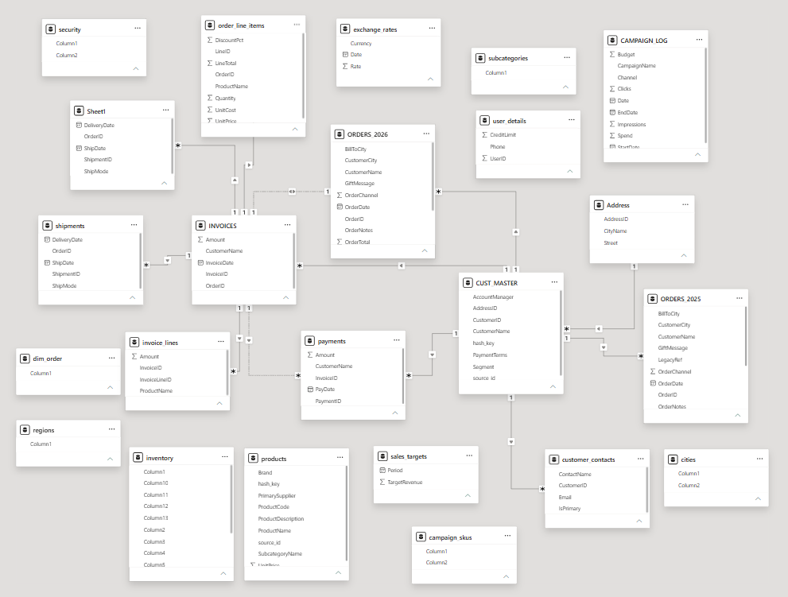
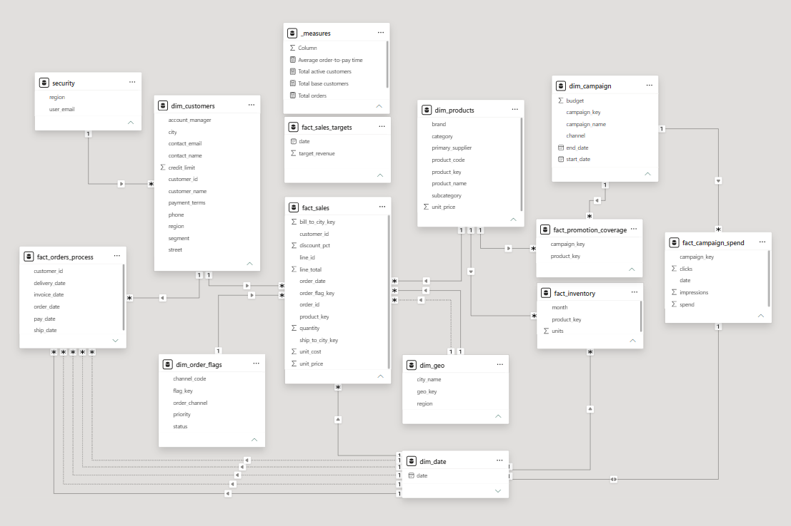
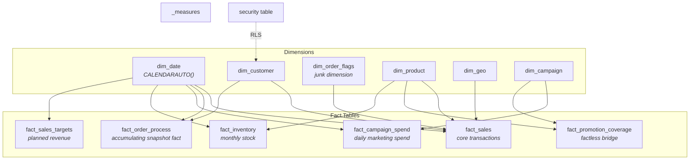

# 🌌 Rebuilding a Broken Power BI Model into a Production-Ready Star Schema
### A Power BI Data Modeling Deep-Dive


> **23 raw, tangled tables. One deliberately broken data model. Zero shortcuts.**
> This repository documents the full rebuild of a chaos dataset into a tested, secured, production-style star schema — following the same discipline a real BI engagement demands.

---

## 📸 Preview

<!-- Replace with your actual screenshots -->
| Before: The Chaos | After: The Star Schema (Galaxy) |
|:---:|:---:|
|  |  |


---

## 🎯 TL;DR

I was handed a Power BI dataset engineered to look exactly like the kind of model that ruins reports in real companies: many-to-many relationships firing in every direction, duplicate imports, cryptic technical IDs, mixed naming conventions, and at least one table that was pure garbage. My job was to turn it into a **clean, testable, secure star schema** — from raw tables to Row-Level Security — using the same standards, checks, and debugging discipline a senior BI developer would apply on a client project.

**The result:** 23 chaotic source tables consolidated into a governed model of 4 core dimensions, 6 purpose-built fact tables, a self-maintaining date dimension, a centralized measures library, and region-based security — with every structural change verified against a protected "sentinel" total before it was ever trusted.

📖 **Want the full story — the debugging incidents, the trade-off decisions, the DAX?**
👉 See **[`Elaborated_walkthrough.md`](./Elaborated_walkthrough.md)** for the complete, step-by-step narrative.

---

## 🧩 The Challenge

The starting dataset simulated the exact failure mode most companies eventually hit: dashboards built directly on top of raw source tables, with no modeling layer in between. The symptoms were everywhere —

- 🕸️ Many-to-many relationships and bidirectional filters, with **facts wired directly to other facts**
- 👯 Duplicate tables from bad imports (`shipments` vs `sheet1` — identical, unexplained)
- 🗑️ At least one table with zero usable content (`dimension_order`)
- 🔤 Mixed naming conventions (PascalCase, camelCase, raw source labels) across tables
- 🔑 A tangle of hash keys, source IDs, and cryptic numeric codes with no documented meaning
- 👤 The same real-world entity referred to by two different names (`customer` vs `user`) depending on which table you opened

None of this is exaggerated for effect — it's a faithful composite of patterns that show up constantly in production BI environments once reporting gets bolted onto operational data without a modeling layer.

---

## 🏗️ What This Project Demonstrates

| Skill Area | Applied |
|---|---|
| **Dimensional Modeling** | Star schema design, grain analysis, snowflake-vs-star trade-offs, junk dimensions, factless facts, accumulating snapshot facts, role-playing dimensions |
| **Power Query (M)** | Merges, appends, unpivoting, delimiter splitting/exploding, deduplication, cardinality testing, folder-based query organization |
| **Data Quality Debugging** | Caught and resolved a live fan-out bug caused by duplicate dimension rows — verified using a protected sentinel measure |
| **DAX** | `CALENDARAUTO()`, `DISTINCTCOUNT` vs `COUNTROWS` grain-awareness, `DATEDIFF`, `LOOKUPVALUE`, `USERPRINCIPALNAME()`, `USERELATIONSHIP` |
| **Security** | Region-based Row-Level Security, tested via user impersonation (`View As`) |
| **Governance & Standards** | Naming conventions, surrogate key discipline, a single centralized measures table, documented technical debt |

---

## 🌠 The Final Architecture

Six purpose-built fact tables, each connected only through shared dimensions — never to each other:


.png)

<details>
<summary><strong>📐 Click to see the modeling patterns used</strong></summary>

<br>

- **Star schema, strictly enforced** — no fact-to-fact relationships anywhere in the model
- **Junk dimension** (`dim_order_flags`) — bundles unrelated low-cardinality flags (channel, status, priority) instead of spawning three tiny dimensions
- **Factless fact** (`fact_promotion_coverage`) — a pure many-to-many bridge (campaign ↔ product) with keys but no measures
- **Accumulating snapshot fact** (`fact_order_fulfillment`) — one row per order, progressively filled in with milestone dates across a 5-stage process (Order → Ship → Deliver → Invoice → Pay)
- **Role-playing dimensions** — `dim_geo` and `dim_date` each connect to the same fact table more than once (e.g. ship-to vs. bill-to city), with only one relationship active at a time
- **Self-maintaining date dimension** — built with `CALENDARAUTO()`, automatically expanding as new data loads, with zero manual upkeep

</details>

---

## 🗂️ Repository Structure

```
├── README.md                    → you are here
├── Elaborated_walkthrough.md    → full step-by-step build narrative, decisions & debugging
├── data_remodel_project.pbix    → the Power BI file itself
├── docs/
│   └── images/                  → model screenshots, before/after visuals
|   └── phases/
|   └── rules & standards/                
└── dataset                      → source data used for the build
```

<!-- Adjust this tree to match your actual repo layout -->

---

## 🛠️ How the Model Was Built — Highlights

A few of the moments that made this more than a routine "connect the tables" exercise:

- 🔍 **A live fan-out bug, caught in the act.** Merging products by name unexpectedly inflated total sales. Root cause: two duplicate rows for the same product in the source dimension, with different completeness. Diagnosed via grouping/counting, fixed upstream, and re-verified against a protected sentinel measure — not patched over, actually resolved. *(Full story in the walkthrough.)*
- 🧠 **A header/detail decision that avoided a classic trap.** Rather than building separate fact tables for order headers and order line items (and connecting them fact-to-fact — a common but serious anti-pattern), the fact table was built from the true transaction grain, with the header used only to supply dimensional context.
- ⏱️ **An accumulating snapshot instead of five redundant fact tables.** Recognized that Orders → Shipping → Delivery → Invoicing → Payment all repeat the *same* revenue figure, and that the real analytical value was in the *timing* between stages — not five copies of the same number.
- 🔐 **Row-Level Security, actually tested.** Region-based RLS wasn't just wired up — it was validated by impersonating a real user identity and confirming totals shrank correctly, then reverted to confirm the unrestricted view still worked.

👉 Every one of these is broken down in full — including the DAX, the Power Query steps, and the reasoning behind each trade-off — in **[`Elaborated_walkthrough.md`](./Elaborated_walkthrough.md)**.

---

## Ground Rules Followed Throughout

1. **Star schema only** — facts never connect directly to other facts
2. **Know the grain before touching a table** — every merge was grain-checked first
3. **Every column earns its place** — unnecessary columns were dropped, not hoarded "just in case"
4. **Protect the numbers** — a sentinel measure was checked after every structural change
5. **Standards defined up front, followed to the end** — `snake_case`, `dim_`/`fact_` prefixes, `_key` suffixes for surrogate keys, human-friendly names throughout

---

## Getting Started

1. Clone this repository
2. Open `<project>.pbix` in Power BI Desktop
3. Explore the **Model View** to see the final star schema
4. Check the **`_measures`** table for the centralized DAX measure library
5. Read **[`Elaborated_walkthrough.md`](./Elaborated_walkthrough.md)** for the complete build narrative

---

## Acknowledgments

This project was built as a hands-on exercise following a comprehensive Power BI data modeling walkthrough, then implemented, tested, and documented independently as a portfolio piece.

---

## Author

Sahaj K.

</div>
